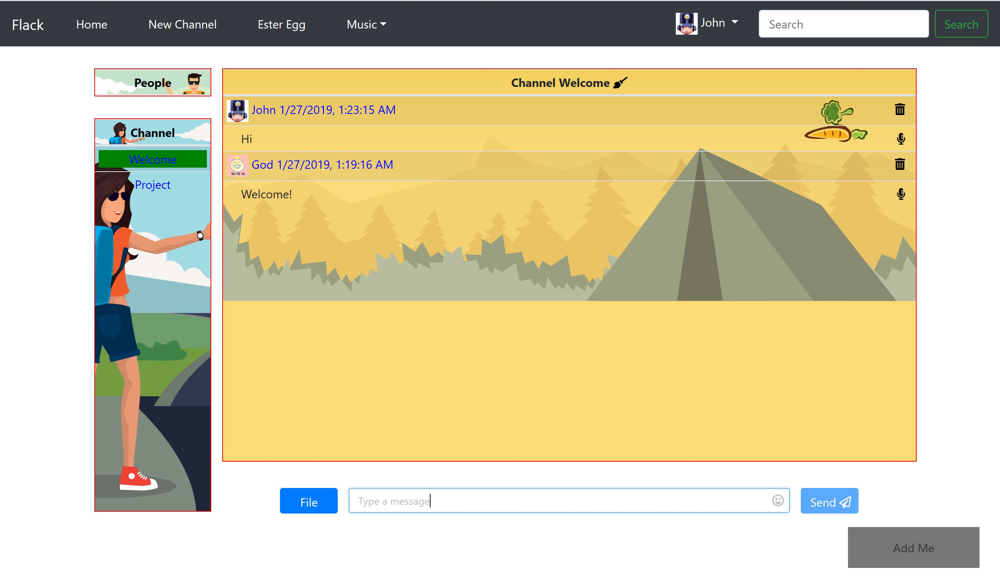
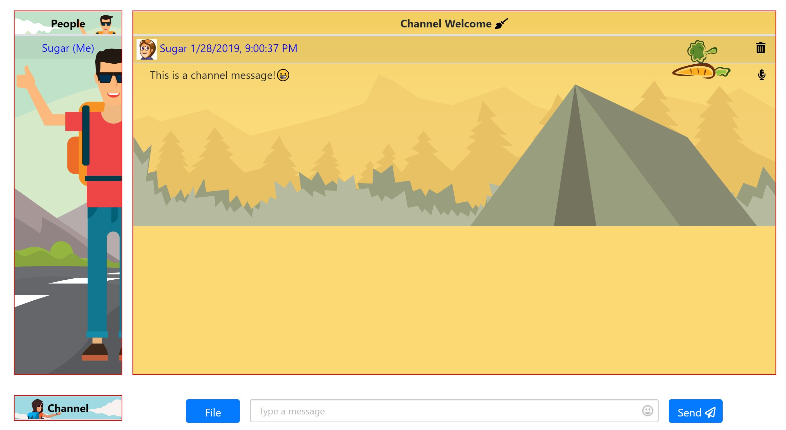
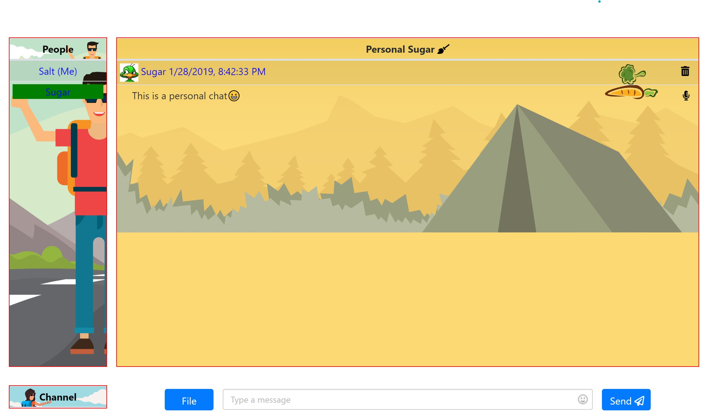
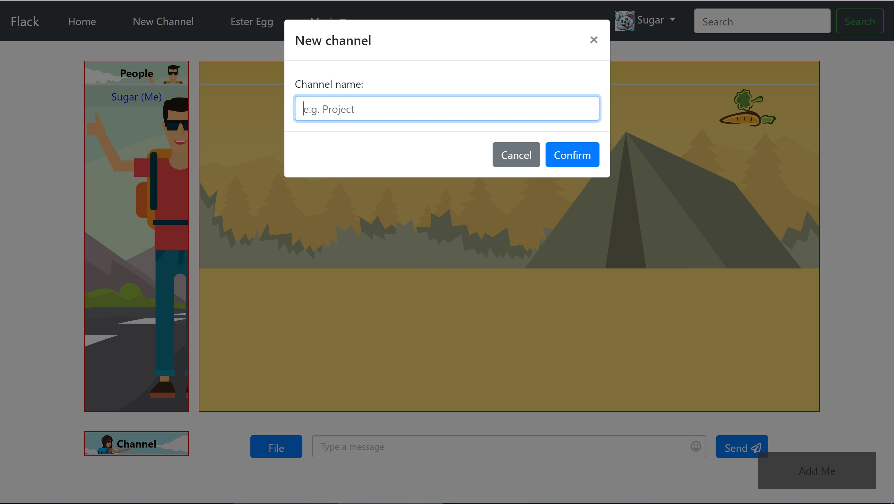
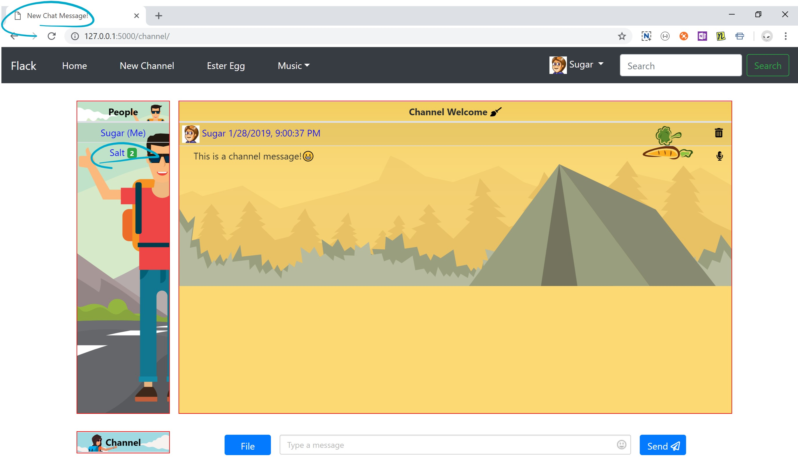
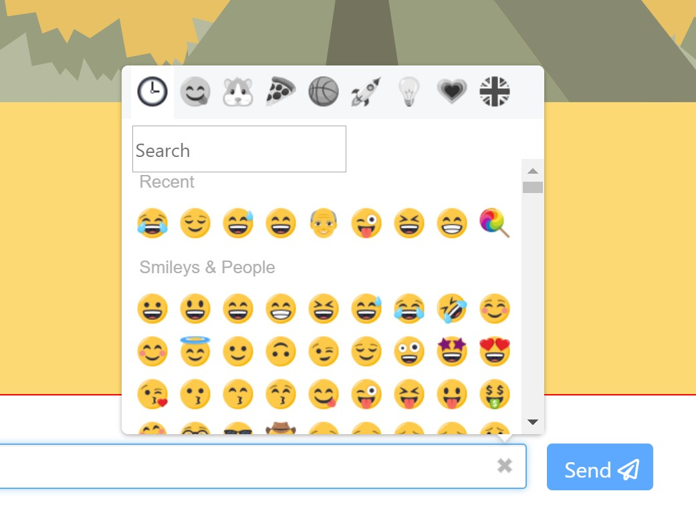
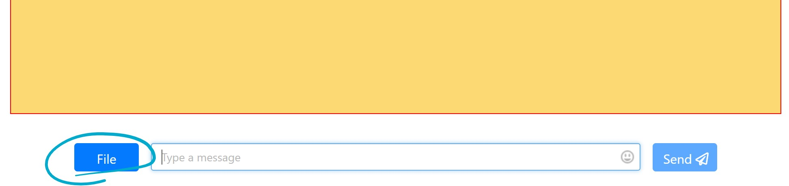
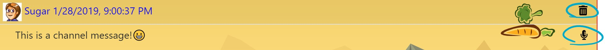

# Flack

This is an online messaging service web page using Flask, similar in spirit to [Slack](https://slack.com/). Users will be able to sign into your site with a display name, create channels (i.e. chatrooms) to communicate in, as well as see and join existing channels. Once a channel is selected, users will be able to send and receive messages with one another in real time. Finally, add a personal touch to your chat application! 

### Preview:




[Live Demo](http://chat-ya.herokuapp.com)

### Features
- Channel chat

    

- Personal chat

    

- Channel creation: 
  
    

- Flashing page title notification and unread messages badges

    
    
- Emoji

    

- File attachment

    

- Delete message and text to speech(English only for now)

    

## Getting Started

These instructions will get you a copy of the project up and running on your local machine for development and testing purposes. See deployment for notes on how to deploy the project on a live system.

### Prerequisite

```
pip install -r requirements.txt
```

## Running the test

```
python application.py
```
And open the link on the terminal like below in your browser:
```
* Restarting with stat
* Debugger is active!
* Debugger PIN: 294-796-527
(23760) wsgi starting up on http://127.0.0.1:5000
```

## Deployment

Configure Procfile:
```
web: gunicorn --worker-class eventlet -w 1 application:app
```

[Tutorial: Deploy app to Heroku](https://devcenter.heroku.com/articles/getting-started-with-python#deploy-the-app)

## Known Issues

- Messages are coming from top rather than from bottom
- Better support for mobile device

## More features:

- User live typing detection 
- Send voice message
- Search functionality

## Contribution
Emoji support: [EmojioneArea](https://github.com/mervick/emojionearea)

## Author
* **Zhengguan Li**

